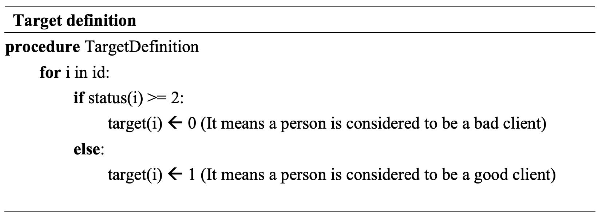
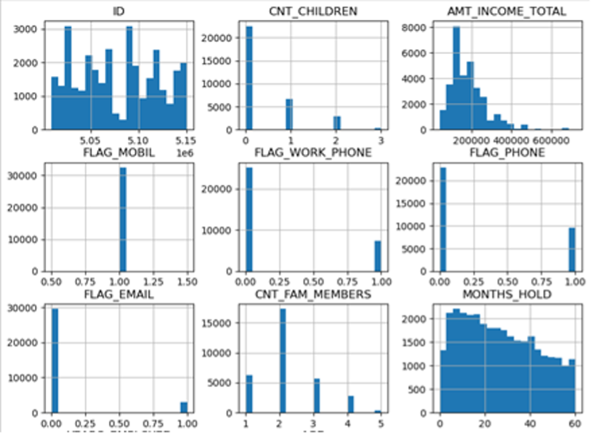
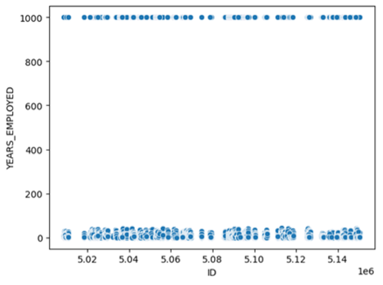
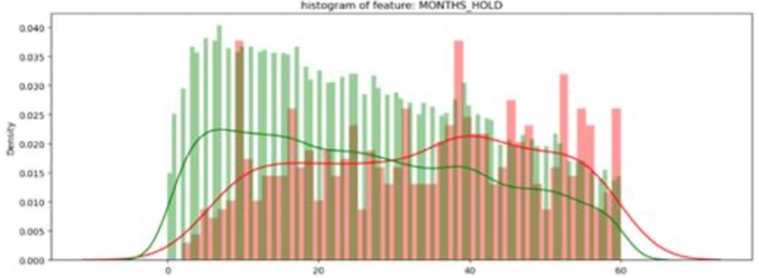
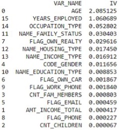
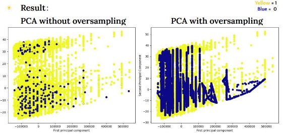
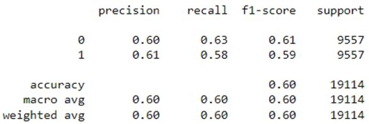
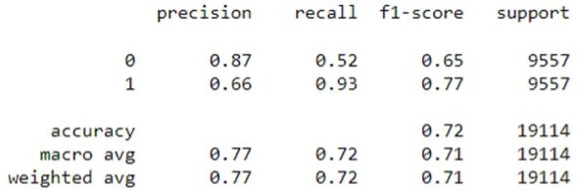
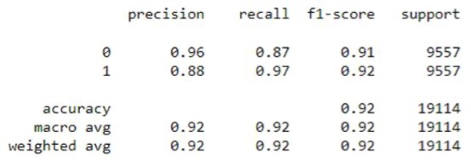
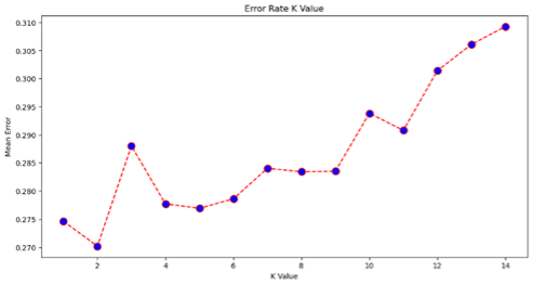

# Credit Card Approval Prediction

## 1. Introduction:

Credit cards are widely used for payments, but the manual processing of credit card applications is prone to errors and inefficiencies. To improve productivity and efficiency, machine learning-based credit card approval predictions have become valuable. With advancements in technology and the era of big data, machine learning plays a significant role in predictive analysis. Financial institutions and banks face the challenge of assessing risk factors when providing credit to customers. Machine learning tools can be used to identify low-risk customers and minimize the risk of credit defaults. In this study, we utilize individual information and applicant data to predict the likelihood of future credit card defaults. We conduct exploratory data analysis, compare supervised machine learning algorithms, extract key features for identifying "bad" clients, and select the best-performing algorithm for credit card approval predictions. The chosen algorithm achieves approximately 90% accuracy in prediction. This project highlights the use of machine learning in detecting credit risk and presents findings on customer credit risk assessment.

### 1.1 Dataset
The data was collected from the Kaggle Platform. Application_record.csv showed the credit card
application records and it contains around 430,000 rows & 18 features. Credit_record.csv show
monthly credit card account status respectively and it contains around 1,000,000 rows
& 3 features. 

### 1.2 Challenge

In this project, there are the following challenges:
- The dataset is **highly imbalanced**.
- The definition of **'good' or 'bad' is not given**. The target must be defined

### 1.3 Objective

Our achievement in this project is to:
- Determine the **important features** that affect the credit card approval result.
- Use predictors to **predict** the credit card approval result with high accuracy

## 2 Data Processing

### 2.1 Data Integration – defining target and merging

In the dataset, due payment days can be observed. Assume that a person is considered **a ‘Bad’ client if he has unpaid payments for more than 60 days**. Status is defined by:

#### The definition of Status variable

| Status  | Meaning |
| ------------- | ------------- |
| 0  | 1-29 days past due  |
| 1  | 30-59 days past due  |
| 2  | 60-89 days overdue  |
| 3  | 90-119 days overdue  |
| 4  | 120-149 days overdue  |
| 5  | Overdue or bad debts, write-offs for more than 150 days  |
| C  | Paid off that month  |
| X  | No loan for the month  |

The target is determined by below logic:

### 2.2 Data Cleaning

#### 2.2.1 Remove duplicate
> After duplicate removal by using Pandas, the data left 32713 rows.
#### 2.2.2 Filter unwanted outliers
> Handling ouliter using 99.7 rule(Make sure don't remove many information)
#### 2.2.3 Handle missing value
> One variable has 14% missing values, which is the categorical feature. The solution is to ignore missing values.

### 2.3 Data Wrangling

#### 2.3.1 One-hot encoding
> One-hot encoding is utilized to transform categorical data into separate columns in the dataset.

#### 2.3.2 Train-test splitting
> Train-test splitting is applied at a ratio of 7:3 to prevent overfitting.

#### 2.3.3 Oversampling
> SMOTE is employed to address imbalanced data. It's important to note that oversampling is performed after the train-test split to avoid the possibility of observations from the minority class in the training dataset appearing in the testing dataset. This ensures that the algorithm does not learn from similar instances and prevents any potential bias or cheating.

## 3. Exploratory data analysis (EDA)

### 3.1 The distribution of different variables

- The figure shows that FLAG_MOBIL is useless data since the data records that all people have mobile phones. This column needs to be dropped.
- If a person is at work, the probability of being a good client will be higher than the unemployed person.

### 3.2 The distribution of YEARS_EMPLOYED

- The figure showed that some people have around 1000 YEARS_EMPLOYED. After checking, we found that they are both pensioners. Assume that most people around 40-45 YEARS_EMPLOYED are going to become pensioners. ➔ Solution: transform 1000 to [40,45] uniform randomly.

### 3.3 The distribution of MONTHS_HOLD

- MONTHS_HOLD should not be a predictor since it refers to the month the user holds the credit card. It may lead to overfitting. This column also needs to be dropped.

## 4. Analysis importance features

Information value (IV) is measured in the powers among the predictors, which
determine the important variables in the predictive model. It ranks variables based on their importance. 

### 4.1 Rules Related to Information Value
| Information  | Value |
| ------------- | ------------- |
| <0.02  | Useless  |
| 0.02 - 0.1  | Weak  |
| 0.1 - 0.3 | Medium  |
| 0.3 - 0.5  | Strong  |
| >0.5  | Good  |

### 4.2  Iv value of features

The figure showed that AGE and YEARS_EMPLOYED are the top 2 important features.

## 5. PCA

Unsupervised learning is applied to test does PCA fits the data well.

### 5.1 PCA result

Supervised machine learning is preferred over unsupervised learning for the dataset, as it contains a specific set of predictors and lacks clear classification boundaries or distinct clusters.

## 6. Selection of Supervised model 

### 6.1 Logistic Regression
> Logistic Regression is chosen for its interpretability and efficiency. Information Value is designed mainly for the binary logistic regression models. Features’ IV value < 0.01 is decided to be removed.

### 6.2 KNN
> KNN for its simplicity and ability to capture complex patterns. Feature selection via IV value and using them in KNN and XGBoost model might not produce the most accuracy. IV value should not be used in KNN and XGBoost models.

### 6.3 XGBoost
> XGBoost for its high performance and flexibility in handling diverse data types. It is currently the most common algorithm in Kaggle competitions, and it is also the model used by most winners. 

These models provide a range of options to suit different datasets and classification requirements.

## 7. Training Result

### 7.1 Logistic Regression

### 7.2 KNN

### 7.3 XGBoost

## 8. Evaluation

### 8.1 5-fold cross-validation

After performing 5-fold cross-validation, the accuracy rate has changed.

| Algorithm  | Value change |
| ------------- | ------------- |
| Logistic Regression  | 60% --> 58%  |
| KNN | 70% --> 94%  |
| XGBoost | 90% --> 94%  |

### 8.2 KNN parameters error rate

It shows that k values are bigger, Error Rate bigger.

### 8.3 5-fold cross-validation with SMOTE

Using SMOTE to avoid inaccurate evaluation metrics when using 5-fold cross-validation. After performing a 5-fold cross-validation with SMOTE, the accuracy rate has changed.

| Algorithm  | Value change |
| ------------- | ------------- |
| Logistic Regression  | 60% --> 58%  |
| KNN | 70% --> 89%  |
| XGBoost | 90% --> 93%  |

### 8.4 Comparing accuracy

The performance of the simple train-test spilt is the poorest. The performance of the KNN and XGBoost models via 5-fold cross-validation with SMOTE is slightly decreased compared to the models via 5-fold cross-validation.

| Accuracy  | Simple train-test spilt | 5-fold | 5-fold with SMOTE |
| ------------- | ------------- | ------------- | ------------- |
| Logistic Regression  | 60% | 58% | 58% |
| KNN | 70% | 94% | 89% | 
| XGBoost | 90% | 94% | 93% |

## 9. Discussion

### Further discussion on cross-validation for imbalanced datasets 

5-fold cross-validation (performing oversampling before executing cross-validation) and 5-fold cross-validation with SMOTE (performing oversampling during cross-validation) are both adopted for model validation in this paper. We found that performing oversampling before executing cross-validation seems "efficient". However, the fact is that we are overestimating the classification performance while adopting this method. Therefore, performing oversampling during cross-validation is the correct way of handling imbalanced data. 

## Conclusion

In conclusion, AGE and YEAR_EMPLOYED are the important features in the predictors, which means they can easily interpret the credit card approval result. On the other hand, XGBoost has the highest performance with 90-95% accuracy. Therefore, XGBoost should be applied to the business situation to optimize the prediction result.

