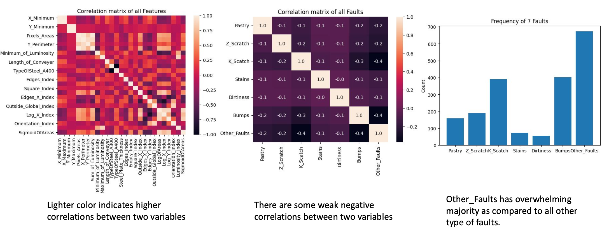

# Steel Plates Faults Detection

## Introduction
The prediction of steel plate faults can help prevent accidents that could harm humans. As the response variable is binary, our goal is to train several classification models to classify the type of fault in steel plates. We will compare the performance of different models to identify the best model for predicting faults.

## Dataset
This dataset comes from research conducted by Semeion, Research Center of Sciences of Communication. It consists of 1941 observations and includes 27 features describing the geometric shape of faults and 7 class labels indicating the type of fault.

## Data Analysis and Visualization

## Data Preprocessing

1. Data Cleaning
> To ensure the quality of the data, we perform data cleaning procedures. This involves checking for any missing values in the dataset and removing them if found. 

2. Data Splitting
> To evaluate the performance of our models, we split the dataset into a training set and a test set. The training set comprises 70% of the data and is used to train the classification models. The test set, which contains the remaining 30% of the data, is used to assess the models' performance on unseen data. 

3. Data Normalization
> Data normalization is applied to ensure that all the features have a similar scale. This step is important because features with different scales can disproportionately influence the model's learning process. In our case, we employ two common normalization techniques: Min-Max normalization and standardization. 

4. Oversampling
> Imbalanced classes can pose a challenge in classification tasks, where one class has significantly fewer instances than the others. In our case, we handle the imbalanced classes by employing oversampling techniques. Oversampling involves creating synthetic samples of the minority class to balance the class distribution. 

## Model Selection - Classification Models

### Justification

The justification for selecting classification models over regression models is based on two factors:

1. The dataset consists of multiple categories, indicating that the problem is a classification task rather than a regression task. Classification models are specifically designed to handle categorical or discrete target variables. 2. The dataset includes labels, which means we have labeled instances indicating the type of fault. This further confirms that the problem is a classification task.
   
> Given these factors, we believe that using regression models instead of classification models would lead to lower accuracy in predicting the type of faults in steel plates.

### Methods

In this study, we employed four classification methods to predict the type of faults in steel plates:

1. K Nearest Neighbor (KNN)

> - KNN is a density-based classification algorithm that predicts the class of a sample based on the classes of its k nearest neighbors.
> - In our case, we set the value of k to 3, meaning that the algorithm considers the labels of the three closest neighbors to make predictions.

2. Logistic Regression

> - Logistic Regression is a linear classification algorithm that models the relationship between the independent variables and the probability of a certain class.
> - It assumes that the logarithm of the odds of the target variable is a linear combination of the predictor variables.

3. Random Forest

> - Random Forest is an ensemble learning method that combines multiple decision trees to make predictions.

4. XGBoost

> - XGBoost is an optimized gradient boosting algorithm that builds an ensemble of weak classification models.

### Principal Component Analysis (PCA)

To reduce the dimensionality of the dataset and improve computational efficiency, we employed Principal Component Analysis (PCA).

In our case, PCA was used to reduce the dimensionality of the features from 27 to 19.

### Implementation with and without PCA

To evaluate the impact of dimensionality reduction, we implemented all the classification models both with and without PCA.

1. The models without PCA used the original 27 features as input.
2. The models with PCA used the reduced set of 19 principal components as input.
3. By comparing the performance of the models with and without PCA, we can assess the effectiveness of dimensionality reduction in improving the model's accuracy and efficiency.

## Results - Comparison
The fault diagnosis performance of the models was evaluated using statistical accuracy.

Model without PCA:

Random Forest performed the best with an accuracy of 76.0%.
K Nearest Neighbor and XGBoost achieved accuracy above 70%.

Model with PCA:

Random Forest performed the best with an accuracy of 76.7%.
K Nearest Neighbor and XGBoost achieved accuracy above 70%.

## Conclusion
In this report, we trained four classification models to predict the type of faults in steel plates. Three of the models were learned from class, including K-Nearest Neighbor, Random Forest, and Logistic Regression. An additional model not covered in class, Extreme Gradient Boosting, was also used. We split the data into a training set and a test set. Dimension reduction was performed using PCA, reducing the number of predictors from 27 to 19. After comparing the models with and without PCA, we found that the Random Forest model with PCA performed the best, achieving the highest accuracy of 76.7%. We also observed that even without PCA, the Random Forest model still outperformed the other models.
