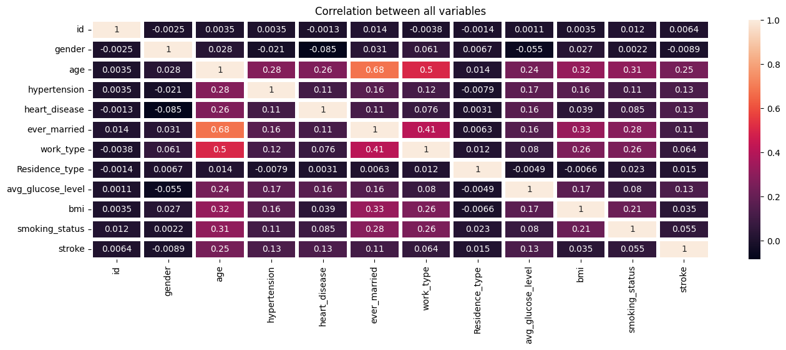
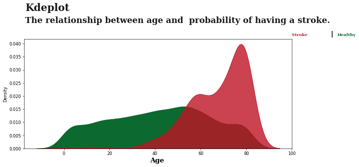

# Stroke Analysis and Prediction

## Source Code
[links](https://github.com/Sapphire0628/Machine-Learning-Project/blob/main/Strokes%20Prediction/SourceCode.ipynb)

## Introduction
Stroke is a medical emergency that is a leading cause of death globally. In 2019, it was the second leading cause of death, resulting in someone dying every 3.5 minutes. Stroke can lead to various complications, including difficulty talking or swallowing, memory loss, thinking difficulties, and loss of muscle movement.

## Objective
The objective of this project is to analyze and predict strokes based on various factors.

## Dataset

The dataset contains attributes such as gender, age, hypertension, heart disease, marital status, work type, residence type, average glucose level, BMI, smoking status, and stroke occurrence. These attributes provide information about the patients' health and demographic factors. The dataset also includes a unique identifier for each instance and accounts for cases where smoking status information is unavailable.

## Data Visualization

> The following factors have been identified as being associated with strokes:

> - Age
> - Marital status
> - Heart disease
> - Average glucose level
> - Hypertension

> From the analysis, it was observed that individuals aged over 60 and those with blood glucose levels higher than 150 are more prone to strokes. The feature of marital status was found to be irrelevant in stroke prediction, as it increases with age.

## Data Preprocessing

Data preprocessing techniques were applied to ensure the quality and suitability of the data for analysis. The following steps were performed:

1. Handling missing data: Incomplete data entries in the dataset were addressed.
2. Feature encoding: Categorical values of relevant features were converted into numerical values.
3. Splitting dataset: The dataset was split to detect underfitting or overfitting of the model.
4. Feature normalization: Feature normalization was performed to enable faster convergence in machine learning.
5. Upsampling data: Imbalanced datasets were addressed by upsampling the minority class to avoid poor performance.

## Data Modeling

Classification models were selected and evaluated to predict strokes. The following models were used:

| Classification models | Accuracy Score | ROC AUC Score | Precision | Recall | F1 |
|-------------------|------------------|---------------|-------|-----------|--------------|
| Logistic Regression | 0.768           | 0.77        | 0.75   | 0.80      | 0.78        | 
| Decision Tree       | 0.85           | 0.85        | 0.93   | 0.75         | 0.83        | 

> Based on the evaluation, the decision tree model outperformed the others by minimizing overfitting on the sample data.

## Results Interpretation, Discussion & Conclusion
The analysis revealed that over 81.1% of stroke patients are overweight, indicating a strong positive correlation between high BMI and stroke. The decision tree model was identified as the best classification model due to its higher performance.

## Insights
To prevent blood sugar spikes, overweight, and stroke, the following recommendations are suggested:

- Eat fewer carbohydrates, especially refined carbs (e.g., rice).
- Reduce sugar intake.
- Increase exercise.
- Consume more fiber-rich foods like vegetables, fruits, and oats.
- Stay hydrated by drinking more water.
- Quit smoking and avoid alcohol consumption.
